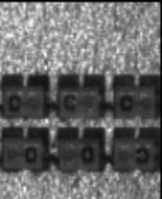
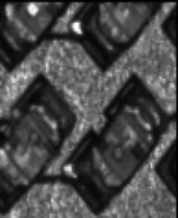
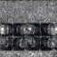
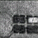
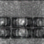
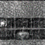

# GAN for Synthetic Solder Joint Image Generation

This project explores the use of generative models to generate synthetic SMT solder joint images.

Models used:
- DCGAN
- StyleGAN
- VAE

---

## Real Solder Joint Images

---

## Synthetic Images Generated by DCGAN

---

## Synthetic Images Generated by StyleGAN

---

## Repository Files

- `DCgan_smt.ipynb` – DCGAN training and image generation
- `Stylegan_smt.ipynb` – StyleGAN implementation
- `VAE.ipynb` – Variational Autoencoder reconstruction model
